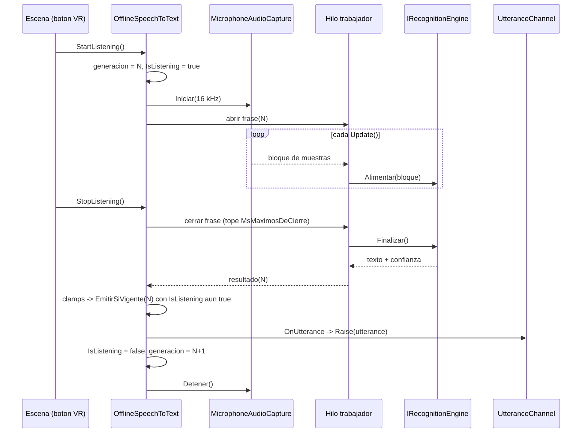
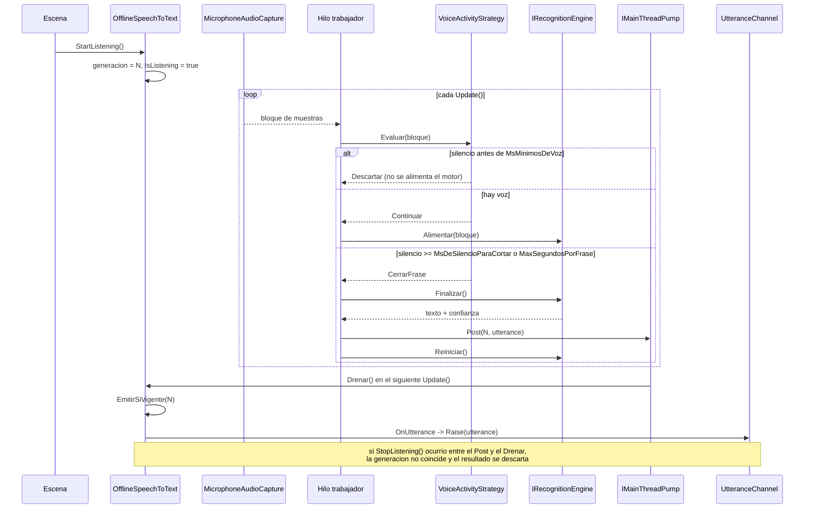

# Design: M1 — Reconocimiento de voz on-device para Quest (Runtime/Speech)

## Modulo y frontera

Modulo unico: `Runtime/Speech/`, ensamblado `NpcAi.Speech`. Su grafo de referencias sigue siendo
exactamente `NpcAi.Core` + `NpcAi.Core.Channels` (esta ultima porque el modulo publica en
`UtteranceChannel` por Inspector). **`NpcAi.Speech.asmdef` no se modifica**: `InternalsVisibleTo` es
un atributo de C#, no un campo de asmdef, y se declara en `Runtime/Speech/Properties/AssemblyInfo.cs`.
`Runtime/Core/` y `Runtime/CoreChannels/` quedan intactos y `Contract.Version` sigue en `1`.
El boton de pulsar-para-hablar lo cablea la escena anfitriona a `StartListening`/`StopListening`:
M1 **no** referencia `NpcAi.VrInput`.

## Technical Approach

Cinco capas, con el hilo en que corre cada una. El nucleo (`OfflineSpeechToText`) es construible sin
microfono, sin motor y sin configuracion — esa es la propiedad que hace pasable el contrato en EditMode.

| Capa | Tipo | Responsabilidad | Hilo |
|---|---|---|---|
| Captura | `MicrophoneAudioCapture : IAudioCapture` | `Microphone.Start` en anillo de 1 s, lectura incremental, remuestreo a 16 kHz | Principal (`GetPosition`/`GetData` son API de Unity) |
| Segmentacion | `ISegmentationStrategy` | decide donde termina la frase dentro de la ventana | Trabajador |
| Motor | `IRecognitionEngine` / `VoskRecognitionEngine` | muestras -> texto + confianza | Trabajador |
| Adaptador | `OfflineSpeechToText : ISpeechToText` | ventana de escucha, generacion, guardas, clamps, emision | Principal |
| Envoltura | `SpeechToTextBehaviour : MonoBehaviour` | permiso de microfono, aprovisionamiento del modelo, bombeo en `Update`, publicacion en `UtteranceChannel` | Principal |

## Architecture Decisions

### Decision 1: entrega del modelo como `TextAsset` (.bytes) empaquetado + extraccion en tiempo de ejecucion

**Eleccion.** El modelo `vosk-model-small-es-0.42` viaja comprimido como un unico
`Runtime/Speech/Plugins/Models/vosk-model-small-es-0.42.bytes` (zip renombrado, importado como
`TextAsset`), referenciado por el asset de configuracion. En el primer arranque,
`SpeechModelProvisioner` lo descomprime a `Application.persistentDataPath/NpcAi/Speech/<idDeModelo>/`
y deja un centinela `.listo` con el id; las siguientes ejecuciones no hacen nada.

| Opcion | Tamano de build | Costo de carga | Portabilidad UPM | Setup del anfitrion |
|---|---|---|---|---|
| `StreamingAssets` del proyecto anfitrion | ~40 MB | en Android **igual exige extraccion**: `streamingAssetsPath` es una URL `jar:file://` dentro del APK y `vosk_model_new` necesita una ruta de archivo real | Baja: el paquete deja de ser autocontenido | Alta: copiar 40 MB a mano en cada clon |
| Addressables | ~40 MB + catalogo | carga asincrona y luego la misma extraccion a disco | Media | Alta: agrega `com.unity.addressables` y un paso de build de contenido |
| **`TextAsset` + extraccion (elegida)** | ~40 MB | una sola vez por instalacion: ~40 MB a memoria gestionada, descompresion y `Resources.UnloadAsset` | Alta: `git clone` y funciona | Ninguno |

**Razon.** La extraccion a disco no es un diferenciador: el modelo de Vosk se abre por ruta de sistema
de archivos y en Android nada dentro del APK lo es, asi que las tres opciones terminan escribiendo en
`persistentDataPath`. Lo que si cambia es quien hace el trabajo. Ademas, el modelo es un **directorio**
con archivos sin extension (`final.mdl`, `HCLr.fst`, `words.txt`); sueltos, el importador de Unity no
los lleva al build de forma confiable. Un unico asset comprimido es la unica forma en que el pipeline
de assets los transporta intactos, y mantiene el paquete UPM autocontenido, que es la propiedad que
mas vale en un trabajo de grado que se clona y se evalua.

**Detalles de implementacion.** Se usa `ZipArchive` sobre un `MemoryStream` (`System.IO.Compression`,
presente en .NET Standard 2.0), **no** `ZipFile.ExtractToDirectory`, cuya disponibilidad depende del
nivel de compatibilidad de API del proyecto anfitrion. Cada entrada se valida: si su ruta resuelta se
sale de la raiz de destino, se rechaza el archivo completo (traversal). El `TextAsset` se libera con
`Resources.UnloadAsset` apenas termina la extraccion.

### Decision 2: la segmentacion es C# gestionado de M1, no el endpointer del motor

**Eleccion.** `IRecognitionEngine` solo expone `EstaListo`, `Reiniciar()`, `Alimentar(float[], int)`,
`Finalizar()`. Los limites de frase los decide `ISegmentationStrategy` dentro de M1.

**Alternativa descartada.** Delegar el corte por silencio al endpointer propio de Vosk.

**Razon.** Es lo que hace que la costura sea de verdad intercambiable: un futuro
`SentisWhisperRecognitionEngine` no trae endpointer, y si la segmentacion viviera en el motor habria
que reescribirla al migrar. Ademas la logica de corte queda probable en EditMode sin modelo ni nativo,
y los umbrales quedan como dato (regla dura 7).

### Decision 3: topologia de hilos — captura en el principal, reconocimiento en un trabajador

**Eleccion.** `Update()` lee el anillo del microfono (API de Unity, obligatoriamente hilo principal) y
encola bloques en una cola concurrente. Un hilo trabajador los consume, evalua la estrategia, alimenta
el motor y, al cerrar frase, hace `Post` de la emision en `IMainThreadPump`. `Update()` drena la bomba
y ahi si se invoca `OnUtterance`.

**Alternativa descartada.** `SynchronizationContext.Post` capturado en el constructor: no existe bucle
de jugador en EditMode, el punto de drenado queda invisible y falla si el objeto se construye fuera del
hilo principal. La bomba explicita tiene un `Drenar()` observable y una implementacion inmediata
(`ImmediateMainThreadPump`, la de por defecto) que hace sincronica la emision en pruebas y en hosting
C# puro.

**Razon.** Alimentar el reconocedor en el hilo principal romperia el presupuesto de 72–90 Hz del Quest;
leer el microfono fuera del hilo principal es ilegal en Unity. La unica topologia valida es esta, y la
bomba es el unico punto por donde el resultado vuelve — lo que concentra la guarda en un solo lugar.

### Decision 4: el cierre de frase por `StopListening` emite **dentro** de `StopListening`

**Eleccion.** Si hay una frase abierta cuando llega `StopListening()`, el orden es: cerrar segmento ->
`Finalizar()` (con tope `MsMaximosDeCierre`) -> `EmitirSiVigente(...)` con `IsListening` todavia en
`true` -> recien ahi `IsListening = false`, `generacion++` y parada del microfono.

**Razon.** En `PulsarParaHablar` la ventana **es** la frase, asi que soltar el boton produce el
resultado que el usuario espera; pero el contrato congelado prohibe emitir *despues* de `StopListening`.
Emitir *durante* `StopListening`, antes de bajar la bandera, es la unica ordenacion que satisface las
dos cosas. El costo es que `StopListening` bloquea el hilo principal; en Vosk el trabajo incremental ya
se hizo al alimentar, y `Finalizar()` solo cierra el lattice, asi que el tope se mide en decenas de ms.
Si en el Quest se ve el tiron, `MsMaximosDeCierre` recorta: **al vencerse se descarta la cola, nunca se
emite tarde.** La invariante del contrato gana sobre la completitud del texto.

### Decision 5: guarda de emision tardia = contador de generacion + revalidacion

```csharp
private bool EmitirSiVigente(int generacion, Utterance frase)
{
    if (generacion != _generacion) return false; // resultado de una ventana anterior
    if (!IsListening)              return false; // ya se detuvo
    OnUtterance?.Invoke(frase);                  // garantizado en el hilo principal
    return true;
}
```

`_generacion` se incrementa en cada **transicion efectiva** de estado (`Start` cuando no escuchaba,
`Stop` cuando escuchaba). El trabajador captura la generacion vigente al abrir la frase y la arrastra
hasta la bomba. La revalidacion de `IsListening` sola no basta: un resultado de la ventana N que llega
durante la ventana N+1 encontraria `IsListening == true` y se emitiria como si fuera de la frase actual.
El contador es lo que cierra ese caso, y tiene prueba propia (ver Testing Strategy).

### Decision 6: M1 no filtra por confianza

Se elimina el campo `ConfianzaMinima` que insinuaba la seccion `Approach` de la propuesta. La
**Decision del usuario 3** es posterior y manda: M1 emite toda `Utterance` con su confianza cruda, y M2
decide si responde `Desconocida`. M1 solo **acota**: `Confidence` a `[0,1]` y `DurationSeconds` a `>= 0`
(G14 es contrato del productor), sin bifurcar por contenido.

### Decision 7: `package.json` no necesita `dependencies`

Vosk no es un paquete del registro: es un binario nativo vendorizado bajo `Runtime/Speech/Plugins/`. No
hay dependencia UPM que declarar, asi que **`package.json` no cambia** (a lo sumo se agregan keywords).
Esto corrige la fila `package.json | Modificado` de la propuesta.

## Data Flow

```
[Escena]--Start/Stop-->[OfflineSpeechToText]
                              |  abre ventana (generacion N)
                              v
 Update() -> MicrophoneAudioCapture -> remuestreo 16k -> ColaConcurrente<float[]>
                                                              |
                                                    [Hilo trabajador]
                                                    ISegmentationStrategy
                                                     |Continuar  |CerrarFrase  |Descartar
                                                     v           v             x
                                              motor.Alimentar  motor.Finalizar
                                                                 |
                                                    clamps + new Utterance
                                                                 |
                                                    IMainThreadPump.Post(N, frase)
                                                                 |
 Update() -> Drenar() -> EmitirSiVigente(N) -> OnUtterance -> UtteranceChannel.Raise
```

## Diagramas de secuencia

### A. `PulsarParaHablar` — la ventana es la frase



### B. `ActividadDeVoz` — la ventana queda abierta y cada corte emite



## Interfaces / Contracts

```csharp
// Runtime/Speech/IRecognitionEngine.cs — costura INTERNA al modulo, nunca un puerto de NpcAi.Core
internal interface IRecognitionEngine : System.IDisposable
{
    bool EstaListo { get; }
    void Reiniciar();
    void Alimentar(float[] muestras, int cantidad);   // 16 kHz, mono, [-1,1]
    RecognitionResult Finalizar();                     // cierra la frase actual
}

internal readonly struct RecognitionResult
{
    public readonly string Texto;
    public readonly float  ConfianzaCruda;   // media de conf por palabra; 0 si no hay palabras
    public readonly int    MuestrasAlimentadas;
}

// Runtime/Speech/Segmentation/ISegmentationStrategy.cs
internal enum SegmentDecision { Continuar, CerrarFrase, Descartar }

internal interface ISegmentationStrategy
{
    void AbrirVentana();
    SegmentDecision Evaluar(float[] muestras, int cantidad, double segundosEnFrase);
    void CerrarVentana();
}

// Runtime/Speech/Config/SpeechSettings.cs — snapshot inmutable, sin UnityEngine
public enum TriggerStrategy { PulsarParaHablar, ActividadDeVoz }

// Runtime/Speech/Properties/AssemblyInfo.cs
[assembly: System.Runtime.CompilerServices.InternalsVisibleTo("NpcAi.Speech.Tests")]
```

Costuras `internal` del adaptador (visibles solo para `NpcAi.Speech.Tests`):

| Miembro | Para que |
|---|---|
| `internal bool EmitirParaPrueba(Utterance u)` | espejo de `Emit()` del doble: entra despues de los clamps, con la generacion vigente. Lo llama `EmitTestUtterance`. |
| `internal bool ProcesarResultadoDePrueba(string texto, float conf, float dur, int generacion)` | entra en el mismo punto que el callback del motor: ejercita clamps + generacion + bomba. |
| `internal int GeneracionActual { get; }` | permite a la prueba capturar una generacion vieja y reintentarla. |

## `Data/Speech/` — forma del ScriptableObject

La clase vive en `Runtime/Speech/Config/SpeechSettingsAsset.cs` (`Data/` no tiene asmdef y no compila
codigo); los **assets** viven en `Data/Speech/<Escenario>.asset`, uno por escenario segun la Decision 2
del usuario (p. ej. `Data/Speech/Boardroom.asset`). `[CreateAssetMenu(menuName = "NPC AI/Voz/Configuracion de escucha")]`.
`ToSettings()` devuelve el snapshot POCO que consume el nucleo, asi el nucleo no depende del asset.

| Campo | Tipo | Valor por defecto | Rango (`[Range]` + `OnValidate`) |
|---|---|---|---|
| `Estrategia` | `TriggerStrategy` | `ActividadDeVoz` | enum |
| `TasaDeMuestreo` | `int` | `16000` | 8000–48000 |
| `EtiquetaDeIdioma` | `string` | `"es-CO"` | informativa/diagnostico |
| `ModeloEmpaquetado` | `TextAsset` | `vosk-model-small-es-0.42.bytes` | requerido en runtime real |
| `IdDeModelo` | `string` | `"vosk-model-small-es-0.42"` | carpeta destino + sello de version |
| `DispositivoDeMicrofono` | `string` | `""` (el del sistema) | — |
| `UmbralDeEnergia` | `float` (RMS) | `0.02` | 0–1 |
| `MsMinimosDeVoz` | `int` | `200` | 0–2000 |
| `MsDeSilencioParaCortar` | `int` | `700` | 100–3000 |
| `MsDePreRoll` | `int` | `300` | 0–1000 |
| `MaxSegundosPorFrase` | `float` | `15` | 1–60 |
| `MsMaximosDeCierre` | `int` | `250` | 0–2000 |

No hay campo de confianza minima (Decision 6). Cambiar de VAD a pulsar-para-hablar es editar
`Estrategia` en el asset: `SegmentationFactory.Crear(settings)` es el unico `switch` del modulo.

## Empaquetado del plugin nativo — primero en el repo

```
Runtime/Speech/Plugins/
├── LICENSE-vosk-apache-2.0.txt        # obligacion de atribucion Apache 2.0
├── NOTICE.txt                          # solo si el upstream lo trae
├── Android/arm64-v8a/libvosk.so        # .meta: Any Platform OFF, Android ON, CPU ARM64
├── Windows/x86_64/libvosk.dll          # .meta: Editor (Windows, x86_64) + Standalone Win64
└── Models/vosk-model-small-es-0.42.bytes
```

- `[DllImport("libvosk")]` con esa constante unica resuelve `libvosk.so` en Android y `libvosk.dll` en
  el Editor de Windows; por eso el archivo de Windows se nombra `libvosk`, no `vosk`.
- Los `.meta` de los plugins **deben** commitearse. Si Unity los regenera con valores por defecto, el
  build sale sin el `.so` o con la ABI equivocada y falla en el dispositivo, no en compilacion. Este es
  el primer plugin nativo del repo: no hay precedente que copiar y es el riesgo mas probable del cambio.
- El paquete esta embebido (`Packages/com.poli.npc-ai`), asi que los ajustes del importador son
  editables y persistentes; en un paquete de solo lectura del cache no lo serian.
- No se necesita `allowUnsafeCode`: `float[]` es blittable y se marshala directo a
  `vosk_recognizer_accept_waveform_f`. `vosk_recognizer_set_words(rec, 1)` habilita el `conf` por
  palabra que alimenta `Confidence`.
- El binario del Editor queda bloqueado por Mono durante la sesion: actualizarlo exige reiniciar Unity.
- Con `Managed Stripping Level: High` hay que verificar que la clase de P/Invoke sobreviva; se referencia
  directamente, asi que deberia bastar.
- Permiso `RECORD_AUDIO`: lo pide `SpeechToTextBehaviour` con
  `Permission.RequestUserPermission(Permission.Microphone)` antes del primer `Microphone.Start`.
- `Microphone.GetDeviceCaps`: si 16000 no cae en `[min, max]`, se captura a la tasa nativa y se
  remuestrea (decimacion promediada si el factor es entero, interpolacion lineal si no).

## File Changes

| Archivo | Accion | Descripcion |
|---|---|---|
| `Runtime/Speech/OfflineSpeechToText.cs` | Crear | Adaptador real: ventana, generacion, guardas, clamps, costuras `internal`. |
| `Runtime/Speech/IRecognitionEngine.cs` | Crear | Costura interna + `RecognitionResult`. |
| `Runtime/Speech/Vosk/VoskInterop.cs` | Crear | `DllImport` de `libvosk`. |
| `Runtime/Speech/Vosk/VoskRecognitionEngine.cs` | Crear | Implementacion del motor, parseo JSON, media de `conf`. |
| `Runtime/Speech/Audio/IAudioCapture.cs`, `MicrophoneAudioCapture.cs`, `Resampler.cs` | Crear | Captura y remuestreo a 16 kHz mono. |
| `Runtime/Speech/Segmentation/ISegmentationStrategy.cs`, `PushToTalkStrategy.cs`, `VoiceActivityStrategy.cs`, `SegmentationFactory.cs` | Crear | Las dos estrategias y su unico `switch`. |
| `Runtime/Speech/Threading/IMainThreadPump.cs`, `QueuedMainThreadPump.cs`, `ImmediateMainThreadPump.cs` | Crear | Marshalling al hilo principal. |
| `Runtime/Speech/Config/SpeechSettings.cs`, `SpeechSettingsAsset.cs` | Crear | Snapshot POCO + ScriptableObject. |
| `Runtime/Speech/Model/SpeechModelProvisioner.cs` | Crear | Extraccion idempotente del modelo. |
| `Runtime/Speech/SpeechToTextBehaviour.cs` | Crear | Envoltura opcional: permiso, bombeo, `UtteranceChannel`. |
| `Runtime/Speech/Properties/AssemblyInfo.cs` | Crear | `InternalsVisibleTo("NpcAi.Speech.Tests")`. |
| `Runtime/Speech/Plugins/**` | Crear | Binarios, `.meta` de importador, modelo y licencia Apache 2.0. |
| `Data/Speech/README.md`, `Data/Speech/Boardroom.asset` | Crear | Dato por escenario (regla dura 7). |
| `Tests/EditMode/Speech/*` | Crear | Gemela del contrato + guardas + estrategias + aprovisionamiento + doble del motor. |
| `Runtime/Speech/NpcAi.Speech.asmdef` | **Sin cambio** | Referencias intactas; `InternalsVisibleTo` no es campo de asmdef. |
| `Runtime/Speech/Fakes/ScriptedSpeechToText.cs` | **Sin cambio** | Sigue pasando el mismo contrato. |
| `package.json`, `Runtime/Core/**`, `Runtime/CoreChannels/**` | **Sin cambio** | Vosk es vendorizado, no un paquete UPM (Decision 7). |

## Testing Strategy

Todo corre en EditMode sin microfono, sin modelo y sin una sola llamada nativa: ninguna prueba
construye `VoskRecognitionEngine`. El doble del motor (`FakeRecognitionEngine`) vive en el ensamblado
de pruebas porque `IRecognitionEngine` es `internal`; `Runtime/Speech/Fakes/` sigue siendo solo para el
doble del **puerto**.

| Capa | Que se prueba | Como |
|---|---|---|
| Contrato | `OfflineSpeechToTextTests : SpeechToTextContract` | `CreateSubject() => new OfflineSpeechToText()` (sin motor ni microfono); `EmitTestUtterance => EmitirParaPrueba(u)`. Las 10 pruebas heredadas deben pasar sin cambios. |
| Guarda tardia | un resultado de la ventana N no se emite en la ventana N+1 | capturar `GeneracionActual`, `Start` -> `Stop` -> `Start`, luego `ProcesarResultadoDePrueba(..., generacionVieja)` -> 0 recibidas **aunque `IsListening == true`**. Es la prueba que solo pasa con el contador; la revalidacion sola falla. |
| Guarda tardia | resultado que llega despues de `Stop` | `Start` -> `Stop` -> `ProcesarResultadoDePrueba(..., generacionActual)` -> 0 recibidas. |
| Clamps (G14) | `Confidence` a `[0,1]`, `DurationSeconds >= 0` | `ProcesarResultadoDePrueba("x", 1.7f, -3f, gen)` -> recibida con `1f` y `0f`; `-0.2f` -> `0f`. |
| Sin filtro | confianza baja igual se emite | `conf = 0.05f` -> 1 recibida (Decision 6). |
| Estrategias | VAD corta por silencio | 300 ms de amplitud 0.2 y luego 800 ms de ceros -> exactamente un `CerrarFrase`; solo ceros -> nunca `CerrarFrase`. |
| Estrategias | pulsar-para-hablar no corta solo | misma secuencia sinteticas -> siempre `Continuar` hasta `MaxSegundosPorFrase`. |
| Estrategias | el cambio es dato, no recompilacion | `SegmentationFactory.Crear(settings)` devuelve `PushToTalkStrategy` o `VoiceActivityStrategy` segun `Estrategia`. Respalda el criterio de exito 3. |
| Estrategias | tope duro | `MaxSegundosPorFrase` fuerza `CerrarFrase` en ambas. |
| Configuracion | `OnValidate` acota umbrales fuera de rango | `ScriptableObject.CreateInstance<SpeechSettingsAsset>()` en EditMode. |
| Aprovisionamiento | extraccion idempotente y segura | zip armado en memoria por la prueba, raiz inyectada; segunda llamada es no-op; entrada con `../` es rechazada. |
| Dispositivo | transcripcion es-CO sin red en Quest | **Compuerta humana.** No hay CI ni hardware en fases de agente; se registra como validacion manual, no como prueba automatizada. |

## Threat Matrix

`N/A` — el cambio no toca enrutamiento, comandos de shell, subprocesos, automatizacion de VCS/PR,
clasificacion de archivos ejecutables ni integracion de procesos. Las cinco filas de
`references/threat-matrix.md` (rutas tipo documentacion, seleccion de repositorio git, estado de commit,
estado de push, comandos de PR) son `N/A: el modulo solo lee un microfono, carga una libreria nativa
en el mismo proceso y emite un evento en memoria`. El unico control adyacente que si aplica —
procedencia e integridad del binario vendorizado— se cubre fuera de esta matriz: licencia Apache 2.0
verificada y acompanada en `Plugins/`, y validacion de rutas al descomprimir el modelo (Decision 1).

## Migration / Rollout

No hay migracion. `Contract.Version` no sube y ningun consumidor cambia: M2 y M11 siguen acoplados a
`ISpeechToText` y `UtteranceChannel`. Despliegue en tres cortes naturales, que `sdd-tasks` decidira si
convierte en PRs encadenados (la propuesta ya lo marca como riesgo de presupuesto de revision):
(1) adaptador + guardas + gemela del contrato, (2) captura + estrategias + configuracion,
(3) plugin nativo + modelo + envoltura MonoBehaviour. Los cortes 1 y 2 dejan un modulo compilable y
verde sin ningun binario en el repo, que es exactamente el respaldo si el corte 3 falla.

## Open Questions

- [ ] Peso del repositorio: ~40 MB de modelo entran a git. Definir si se usa Git LFS antes de commitear
      el binario; despues es una reescritura de historia.
- [ ] Convencion UPM de `Third Party Notices.md` en la raiz del paquete: se difiere para no romper la
      frontera de rutas del criterio de exito 5; la licencia queda en `Plugins/`. Confirmar con el asesor.
- [ ] `.dylib` de macOS para el Editor: solo hace falta si algun integrante desarrolla en macOS. Hoy no
      se incluye.
- [ ] Valor real de `MsMaximosDeCierre` en Quest: se fija en 250 ms por diseno y se ajusta con la
      medicion de M11; no hay presupuesto de latencia documentado todavia.
